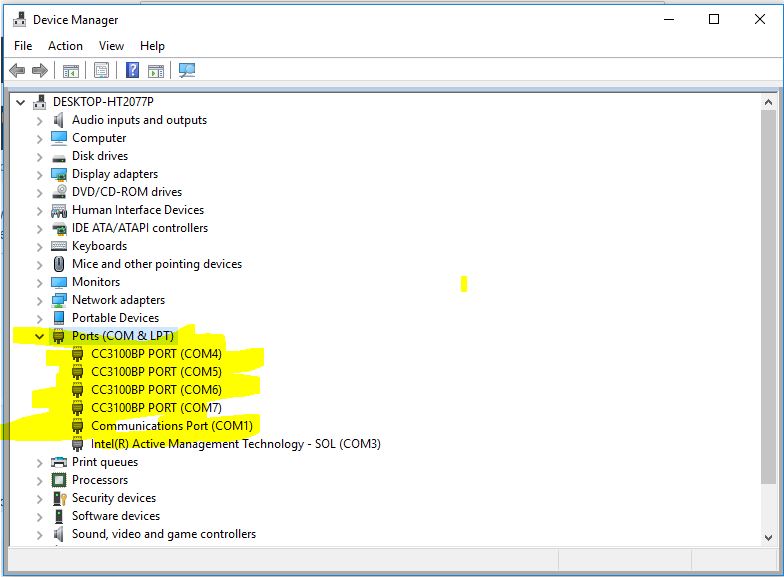

# Instructions for Setting up a workstation
The following [User Guide](http://www.ti.com/lit/ug/swru375d/swru375d.pdf) was used to setup both workstations with CC3100Boost + EMUBoost

## Common environment

- Windows 10 installed using a USB created by using rufus
- Update windows
- Install notepad++ (7.6.1)
- Git for windows (2.20.1)

## Install Software for CC3100 

- CC3100SDK-1.3.0-windows
- Install Uniflash 3.4.1.00012
- Skipped updating service pack
- Connect Boost+EMUBOST to PC / Check Device Manager

## Set up Eclipse and MinGW (Compilers)

- Install jdk-8u191-windows-x64.exe
- Install eclipse-inst-win64.exe for C/C++ developers
- MinGW, mingw32-base, mingw32-gcc-g++ to C:\MinGW
- Add to PATH C:\MinGW\bin

## Run test project

- There is no C:\TI\CC3100SDK_<x.x.x.>\cc3100-sdk\platform\simplelinkstudio
- Install old SDK (CC3100SDK-0.5.1-windows-installer)
- Open New Project C:\TI\CC3100SDK_<x.x.x.>\cc3100-sdk\platform\simplelinkstudio\example_project_eclipse\getting_started_with_station
- Follow the [User Guide](http://www.ti.com/lit/ug/swru375d/swru375d.pdf) to Set Up Project on section: 4.2 Run the Software, option 2 Eclipse  
- To resolve the problem of strange input while debuging [Stackoverflow](https://stackoverflow.com/a/19824801)
	- Create `.gdbinit` 
	- Insert the line `set new-console on` in the `.gdbinit`
