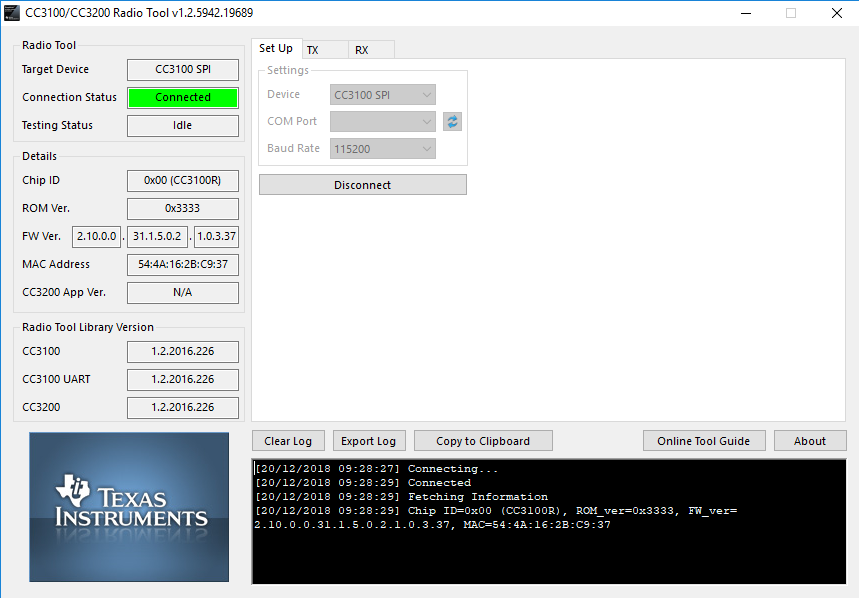

# Print CC3100 Information

## Obtainning the Firmware version and MAC Address with Radio Tool

- Using the [CC3100 & CC3200 Radio Tool](http://processors.wiki.ti.com/index.php/CC3100_%26_CC3200_Radio_Tool#Example_Commands) was possible to retrieve the MAC Add `MAC=54:4A:16:2B:C9:37` and Firmware Version `FW_ver=2.10.0.0.31.1.5.0.2.1.0.3.37` from CC3100 Module  
- By connecting trough the [J6](./J6-port-CC3100.PNG) from the CC3100 module it is possible to execute some other instructions over CLI as can be seen on the [Radio Tool documentation](http://www.ti.com/lit/ug/swru471/swru471.pdf).
	`Note`: It is important to notice that in order to connect to CC3100 to retrieve the configuration it is requiered to connect to J6 port otherwhise you will get [Connection error](./When-connecting-with-UART.PNG).
