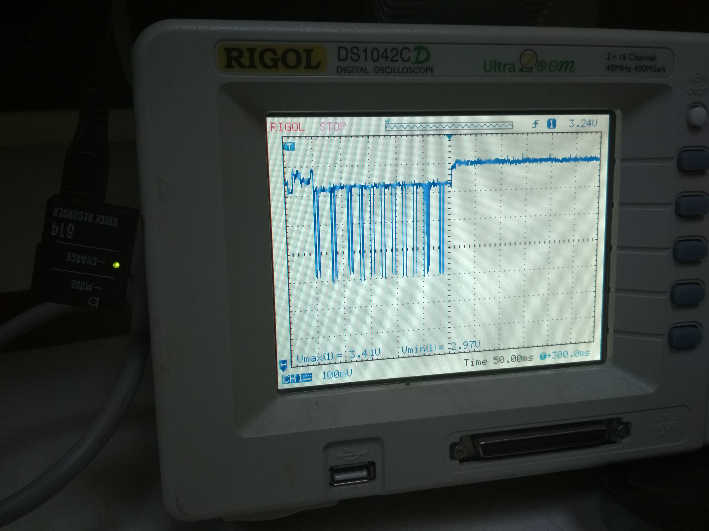

# Power measuring of Active and Passive scans

## Hypothesis

While we are not using the transmitter during the passive scan, we do not consume
to much power for it. But in the other side we do not know how much time the device
should listen each channel to detect available networks around. By the measuring
we trying the answer the question:

> Will passive scan bring power-saving?

## Software

Used repositories have the tag `measurement`.

- All pre-initialization processes was moved to [cc3100-info](https://github.com/silent-dragonfly/cc3100-info/tree/measuring) project. Now,
before measuring CLI commands `cc3100-info active` or `cc3100-info passive` should be executed to set CC3100 processor in appropriate state.
- [cc3100-active-scan](https://github.com/silent-dragonfly/cc3100-active-scan/tree/measuring) are using
default [sl_WlanGetNetworkList()](https://passive-scan.std12.os3.su/simplelink_api/html/group__wlan.html#ga620559124e4421c6887ec67ff50bbbbc), which uses build-in active scan mechanism.
It can be triggered by setting SCAN_INTERVAL with [sl_WlanPolicySet()/SL_POLICY_SCAN](https://passive-scan.std12.os3.su/simplelink_api/html/group__wlan.html#gaa0491d6453e037c857bd10e3be87df3d). After triggering the Active Scan, we wait one second as in [CC3100SDK example](http://processors.wiki.ti.com/index.php/CC3100_Scan_Policies_Application#).
- [cc3100-passive-scan](https://github.com/silent-dragonfly/cc3100-passive-scan/tree/measuring) are made
in similar form of `sl_WlanGetNetworkList()`-function to make comparing clearer.

## Hardware

To measure current draw the CC3100Boost board has the J6 jumper, which is described in [CC3100 BoosterPack Hardware User Guide](http://www.ti.com/lit/ug/swru371b/swru371b.pdf) section "2.5 Measure the CC3100 Current Draw". For measuring current we can just
replace jumper to ammeter, and for measuring voltage there should be the 0.1 Ω
resistor near and oscilloscope can be connected.


- Instead of resister, we used "Digital Multimeter EM3058":


The preliminary measure the resistance of ammeter modes of multimeter:

|set up | resistance |
|-------|----------|
| 2A    | 0.425 Ω  |
| 200mA | 1.259 Ω  |
| 20mA  | 10.300 Ω |

- Digital oscillograph "Rogol DS1042CD":


- The whole workplace (oscillograph has not been connected in the picture):


## Power management policies

Measuring was going with different Power management [policies](https://github.com/silent-dragonfly/cc3100-info/blob/measuring/src/cc3100.c#L489-L492), which can be set with [sl_WlanPolicySet()/SL_POLICY_PM](https://passive-scan.std12.os3.su/simplelink_api/html/group__wlan.html#gaa0491d6453e037c857bd10e3be87df3d). That can be useful to check the difference
between modes.

## Measuring

### SL_NORMAL_POLICY

- Passive Scan:


The square is 100ms by 100mV, we can se 0.1s the device starting an 1s the constant consumption of 90mV during the receiver work.

- Active Scan:


The square is 50ms by 100mV, we are still observing initialization during 0.1 second,
and during 0.25 second we are seeing the impulses, which are corresponding to the
working transmitter.

- Transmission impulse:


The square is 1ms by 100mv, approximately it holds 1ms with 400mV consumption.

### SL_LOW_LATENCY_POLICY

**Other measurement have no big difference in the behavior, only ALWAYS_ON/Active scan can have the piece of interest.**

- Passive Scan:


- Active Scan:


### SL_LOW_POWER_POLICY

- Passive Scan:

- Active Scan:


### SL_ALWAYS_ON_POLICY

- Passive Scan:

- Active Scan:


## Analysis

```
R = 1.250 Ω
U = 3.3 V
```
### Passive scan
- receiving:
```
Uc = 0.090 V (Uc - consuming)
I = Uc / R = 0.090 V / 1.250 Ω = 0.072 A
P = I * U = 0.072 A * 3.3 V = 0.2376 W (during 1 second)
```
### Active scan
- transmitting (one impulse)
```
Uc = 0.400 V
I = Uc / R = 0.400 V / 1.250 Ω = 0.32 A
P = I * U = 0.32 A * 3.3 V = 1.056 W (during 0.001 second)
```
We observed about 24-25 impulses (~25ms) in the working interval (250ms),
the mean consumption will be:
```
1.056W * 0.1 + 0.2376 W * 0.9 = 0.31944 W (during 0.25 second)
```
