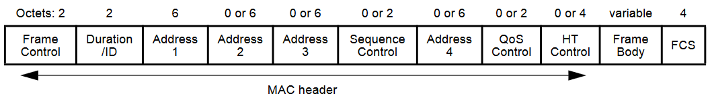
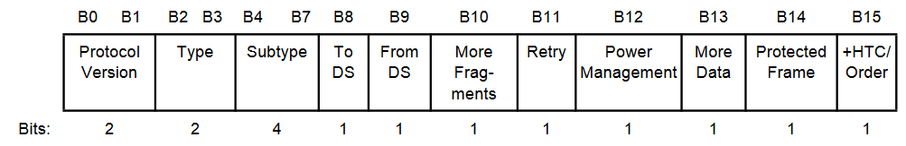

# Frame formats

This page are contained the formats of 802.11 frames (IEEE Std 802.11™-2016, section 9), which are required for implementing passive scan.

## General frame format (9.2.3)

Note: Address 2, Address 3, Sequence Control, Address 4, QoS Control and HT Control are optional fields. Its existence depend on Type and Subtype fields (See below).

### Frame control field (9.2.4.1)

Frame Control field when `Type != 1` or `Subtype != 6` (e.i. not Control Frame Extension).

- **Protocol version** is 0
- **Type** - type of MAC frame (`B3 B2`):
    - `00` / Management
    - `01` / Control
    - `10` / Data
    - `11` / type for Extension
- **Subtype** - consider subtypes are interested for passive scan (`B3 B2 / B7 B6 B5 B4`):
    - `00/0000` - Association Request
    - `00/0001` - Association Response
    - `00/0010` - Reassociation Request
    - `00/0011` - Reassociation Response
    - `00/0100` - Probe Request
    - `00/0101` - Probe Response
    - `00/1000` - Beacon
    - `11/0000` - DMG Beacon (TODO: check purpose of this frame)

## Managements Frames (9.3.3)

- Address 1 - RA (=DA) Receiver Address (=Destination Address)
- Address 2 - TA (=SA) Transmitter Address (=Source Address)
- Address 3 - is BSSID (in our simplified case)
- HT Control is set when +HTC/Order=1 (see Frame Control bit) We will assumed that the Beacon Frame is not needed to be strictly ordered (Or used for HT/High Throughput), but this moment should be proven.

The body consists of the fields, and the elements following after fields.
Order is defined in the standard. We will skip the fields, which are not
required to extract SSID.

The Element has the common structure:

### Association Request frame format (9.3.3.6)

1. Capability Information
2. Listen Interval
3. SSID
4. ...

### Association Response frame format (9.3.3.7)

1. Capability Information
2. Status code
3. ...

With Association Request can be considered as existence of AP with SSID in Association Request.

### Reassociation Request frame format (9.3.3.8)

1. Capability Information
2. Listen Interval
3. Current AP address
4. SSID
4. ...

### Reassociation Response frame format (9.3.3.9)
1. Capability Information
2. Status code
3. ...

With Reassociation Request can be considered as existence of AP with SSID in Reassociation Request.

### Probe Request frame format (9.3.3.10)

1. SSID
2. ...

### Probe Response frame format (9.3.3.11)

1. Timestamp
2. Beacon interval
3. Capability Information
4. SSID
5. ...

### Beacon frame format (9.3.3.3)

1. Timestamp
2. Beacon interval
3. Capability Information
4. SSID
5. ...

### Fields

| Name | Number of octets | IEEE802.11 reference | Comment|
|------|------------------|----------------------|--------|
| Beacon Interval field | 2 | 9.4.1.3 |
| Capability Information | 2 | 9.4.1.4 |
| Current AP Address field| 6 | 9.4.1.5| MAC addr of AP with which STA if associated
| Listen Interval field | 2 | 9.4.1.6 |
| Status Code field | 2 | 9.4.1.9 | 0 - Success
| Timestamp field | 8 | 9.4.1.10 |

### Elements

#### SSID (9.4.2.2)
- ElementID = 0
- Length = 0 - 32
- SSID - 0-32 octets

if Length = 0, it is wildcard SSID (for Probe Request)

In the *Extended Capabilities element* contains field **UTF-8 SSID** with 1, then SSID in UTF-8 encoding, otherwise encoding is not specified (assuming ASCII).

#### Extended Capabilities element (9.4.2.27)

- ElementID = 127
- Length - 1 octet
- Flag field - n octet
    - 48 bit - UTF-8 SSID

