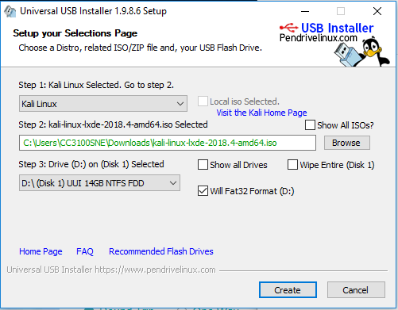
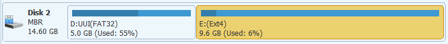

# Create Kali linux 2018 live USB with persistence 

First [download the latest](https://www.kali.org/downloads/) ISO kali linux version, for this project was used `kali-linux-2018.4-amd64.iso` image.
	
To write the ISO files on the USB was used the [Universal USB installer](https://www.portablefreeware.com/index.php?id=1834) then was created the kali linux live using the folowing parameters:

Once the process was , the next step is to create the persistance partition where the files after reboot or shutdown of the PC, will be stored, to do this was used the [MiniTool Partition Wizard](https://www.partitionwizard.com/partitionmagic/portable-partition-magic.html) following the steps recomended on this [guide](https://devanswers.co/guide-kali-linux-2018-live-usb-persistence-windows/), was resized the kali partition and was creted the persistence.

	
	
	
	
	
